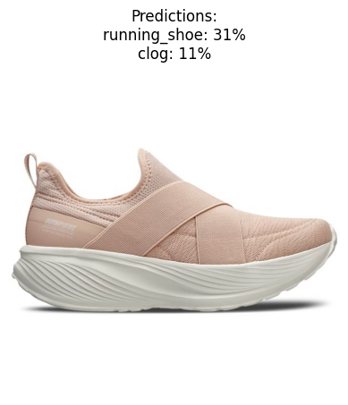
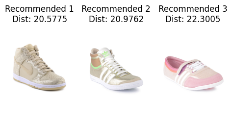

# Fashion Product Recommendation System

Este projeto implementa um sistema de recomendação de produtos de moda com base em imagens. O sistema utiliza o modelo pré-treinado **ResNet50** para extrair características das imagens de calçados femininos e, em seguida, realiza a recomendação de produtos semelhantes usando distâncias euclidianas entre as características extraídas. O objetivo é demonstrar a aplicação de redes neurais convolucionais em problemas de recomendação visual.

## Objetivos

O principal objetivo deste projeto é construir um modelo de recomendação visual para produtos de moda, mais especificamente para calçados femininos, com base em imagens. O sistema sugere produtos semelhantes ao item fornecido pelo usuário, utilizando a similaridade das características extraídas de imagens com o modelo **ResNet50**. O projeto também realiza uma análise exploratória dos dados para entender a distribuição dos produtos por gênero e outras características.

## Desenvolvimento

O processo de desenvolvimento pode ser dividido nas seguintes etapas:

1. **Carregamento e Análise dos Dados**:
   - O dataset de imagens de moda é baixado e as informações sobre os produtos são carregadas de um arquivo CSV.
   - São realizadas análises para entender a distribuição dos produtos, como o número total de produtos e a distribuição por gênero.

2. **Extração de Características**:
   - Utilizando o modelo **ResNet50** pré-treinado em **ImageNet**, são extraídas as características das imagens de calçados femininos. Este modelo é utilizado sem alterações, aproveitando os pesos pré-existentes para gerar representações vetoriais das imagens.

3. **Recomendação de Produtos**:
   - A similaridade entre a imagem de entrada e as imagens do banco de dados é calculada usando distâncias euclidianas nas características extraídas.
   - As imagens mais semelhantes são então exibidas para o usuário como recomendações.

4. **Visualização**:
   - São utilizadas bibliotecas como **Matplotlib** e **Seaborn** para exibir gráficos sobre a distribuição dos produtos por gênero e para apresentar as imagens recomendadas.

## Tecnologias Utilizadas

- **Python**: Linguagem de programação utilizada para o desenvolvimento do projeto.
- **KaggleHub**: Para acessar e baixar o dataset de imagens de moda.
- **Pandas**: Para manipulação e análise de dados estruturados.
- **NumPy**: Para manipulação de arrays e cálculos de distâncias.
- **Keras/TensorFlow**: Para utilizar o modelo pré-treinado **ResNet50** e realizar a extração de características.
- **Matplotlib & Seaborn**: Para visualização dos resultados e gráficos de distribuição.
- **Requests & Pillow**: Para abrir e exibir imagens das URLs dos produtos recomendados.

## Conclusão

Este projeto oferece uma demonstração prática de como utilizar modelos pré-treinados de redes neurais convolucionais para realizar recomendações baseadas em imagens. Embora o modelo não tenha sido explicitamente retreinado, ele mostra como adaptar modelos já treinados para tarefas específicas de recomendação visual. As tecnologias e abordagens empregadas são amplamente utilizadas em sistemas de recomendação e podem ser expandidas para outros domínios de produtos visuais.

